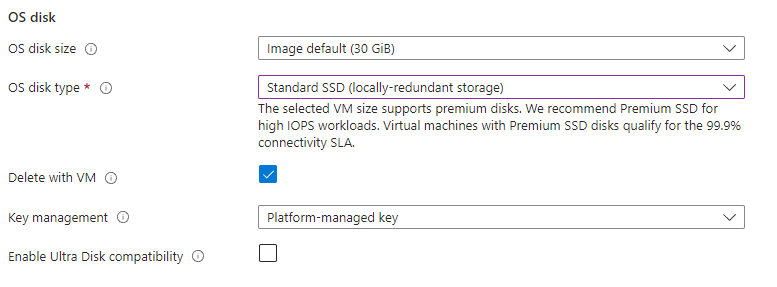
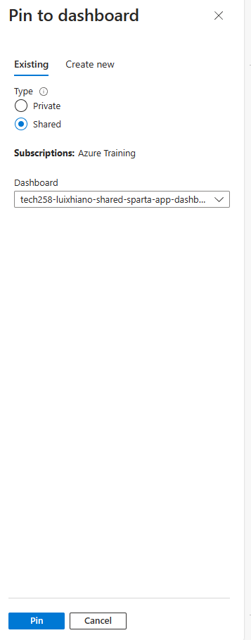
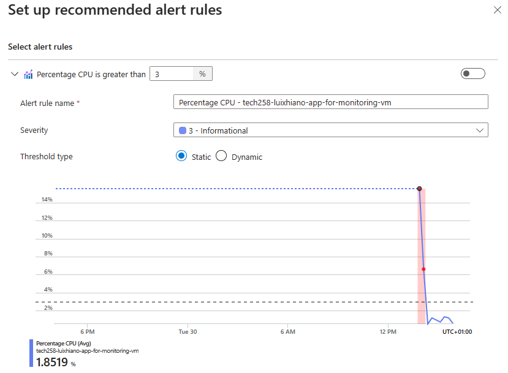
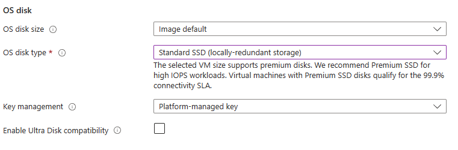
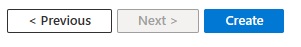

# 2 Tier App deployment

This guide outlines the steps to deploy a 2-tier application on Microsoft Azure. The deployment process involves setting up SSH keys, configuring virtual networks, provisioning virtual machines, deploying a database, and running application scripts. Below are the detailed steps for each component of the deployment process:

- [2 Tier App deployment](#2-tier-app-deployment)
  - [SSH Key](#ssh-key)
  - [- Virtual Network](#--virtual-network)
  - [- Virtual Machine (App)](#--virtual-machine-app)
  - [Database Deployment](#database-deployment)
  - [Database Script](#database-script)
  - [App Script](#app-script)
  - [Testing](#testing)
- [How to create a VM Image in Azure (Database And App)](#how-to-create-a-vm-image-in-azure-database-and-app)
- [Differences between AWS and Azure: SSH Keys, Virtual Networks, and Virtual Machines](#differences-between-aws-and-azure-ssh-keys-virtual-networks-and-virtual-machines)
  - [SSH Keys](#ssh-keys)
    - [AWS](#aws)
    - [Azure](#azure)
  - [Virtual Networks](#virtual-networks)
    - [AWS](#aws-1)
    - [Azure](#azure-1)
  - [Virtual Machines](#virtual-machines)
    - [AWS](#aws-2)
    - [Azure](#azure-2)
  - [More Differences](#more-differences)
  - [User Data](#user-data)
  - [Images](#images)
  - [Monitoring, Alert Management and Auto Scaling](#monitoring-alert-management-and-auto-scaling)
    - [Monitoring Solutions](#monitoring-solutions)
    - [Alert Management](#alert-management)
    - [Auto Scaling](#auto-scaling)
    - [Creating A Dashboard](#creating-a-dashboard)
    - [Performance Testing](#performance-testing)
    - [How To Create An Alert](#how-to-create-an-alert)
    - [Testing Alert](#testing-alert)
  - [Autoscaling Groups](#autoscaling-groups)
    - [Understanding Virtual Machine Scale Sets (VMSS)](#understanding-virtual-machine-scale-sets-vmss)
  - [Steps to Create an Autoscale group](#steps-to-create-an-autoscale-group)
  - [How to SSH into scale set instance](#how-to-ssh-into-scale-set-instance)
  - [How to Delete Scale Set](#how-to-delete-scale-set)


## SSH Key
1. Step 1
Search For SSH keys in azure and click on "SSH keys"


2. Step 2
Click "Create"


3. Step 3
Choose a subscription


4. Step 4
Select the resource group "tech258"


5. Step 5
Make sure the correct Region is selected


6. Step 6
Enter the Key pair name


7. Step 7
For "SSH public key source" either choose Generate new key pair or Upload existing public key, For this I will chooe Upload existing public key


8. Step 8
Enter existing public key


9. Step 9
Create tags


10. Step 10
Review Changes


11. Step 11
Click create


12. Step 12
Refresh and make sure the key is in the list


## - Virtual Network 
13. Step 13 
In the seach bar of Azure, Input Virutal Network and click it, as in step 1.


14. Step 14
Click Create


15. Step 15
Input the Subscription, Resource group, Virtual Network name and Region


16. Step 16
Click IP Addresses


17. Step 17
Click Add Subnet


18. Step 18
Change the name to public-subnet and change the starting address to 10.0.1.0 and change the Size to /24 


19. Step 19
Create a new subnet and Change the name to private-subnet and change the starting address to 10.0.3.0 and change the Size to /24 


20. Step 20
Then hit next and contiue to the tags section and write owner with your tag name


21. Step 21
Review the Virtual Network and press create


22. Step 22
Refresh and Check the list of networks


## - Virtual Machine (App)
23. Step 23 
Click on the serach bar and input "virtual machines" and click Virtual machines


24. Step 24
Click Create


25. Step 25
Click Azure virtual machine


26. Step 26
In project details, Select the Subscription and Resource group


27. Step 27
In the instance details section, Change the Virutal machine name, Region, Image and Size


28. Step 28
In the Administrator account section, Cahnge the Authentication type to SSH public key, Change the Username to adminuser, change the SSH public key source to Use existing key stored in Azure and Select the previous key with Stored Keys


29. Step 29
Click on Disks


30. Step 30
In OS disk, change OS disk type to Standard SSD (locally-redundant storage)



31. Step 31
Click on Networking


32. Step 32
In Network interface, Choose the Virtual network from previous steps and select the public-subnet Subnet.


33. Step 33
Click Advanced for NIC network security group


34. Step 34
For Configure network security group, Click Create new


35. Step 35
Choose a Name and click "Add an inbound rule"


36. Step 36
Click Serivce and then HTTP, Then click Add


37. Step 37
Add another inbound rule, however change Destination port ranges to 3000 and protocol to TCP then click Add 


38. Step 38
Review changes and click ok


39. Step 39
Navigate to Tags


40. Step 40
Click Owner and add Name


41. Step 41
Click Review + create


42. Step 42
Review changes and click Create


43. Step 43
Click refresh and check the list


## Database Deployment
44. Step 44
Complete the steps for the App deployment however for the networking change the subnet to private-subnet.

## Database Script
45. Step 45
Connect to the instance and run the Database script

```
#!/bin/bash

echo updating...
sudo apt update -y
echo done!

echo upgrading packages...
sudo DEBIAN_FRONTEND=noninteractive apt upgrade -y
echo done!

echo importing the public key used by the package management system
sudo apt-get install gnupg curl
echo done!

echo importing the MongoDB public GPG key
curl -fsSL https://www.mongodb.org/static/pgp/server-7.0.asc | \
   sudo -E gpg -o /usr/share/keyrings/mongodb-server-7.0.gpg \
   --dearmor --yes
echo done!

echo creating a list file for MongoDB
echo "deb [ arch=amd64,arm64 signed-by=/usr/share/keyrings/mongodb-server-7.0.gpg ] https://repo.mongodb.org/apt/ubuntu jammy/mongodb-org/7.0 multiverse" | sudo tee /etc/apt/sources.list.d/mongodb-org-7.0.list
echo done!

echo reloading local package database
sudo apt-get update
echo done!

echo installing mongo db 7.0.6
sudo DEBIAN_FRONTEND=noninteractive apt-get install -y mongodb-org=7.0.6 mongodb-org-database=7.0.6 mongodb-org-server=7.0.6 mongodb-mongosh=2.2.4 mongodb-org-mongos=7.0.6 mongodb-org-tools=7.0.6
echo done!

echo set versions
echo "mongodb-org hold" | sudo dpkg --set-selections
echo "mongodb-org-database hold" | sudo dpkg --set-selections
echo "mongodb-org-server hold" | sudo dpkg --set-selections
echo "mongodb-mongosh hold" | sudo dpkg --set-selections
echo "mongodb-org-mongos hold" | sudo dpkg --set-selections
echo "mongodb-org-tools hold" | sudo dpkg --set-selections
echo done!

echo configuring bind IP in mongo db config file - 0.0.0.0
sudo sed -i "s,\\(^[[:blank:]]*bindIp:\\) .*,\\1 0.0.0.0," /etc/mongod.conf
echo done!

echo restarting mongo db #f(or start)
sudo systemctl restart mongod
echo done!

echo enabling mongo db
sudo systemctl enable mongod
echo done!
```
## App Script
46. Step 46
Connect to the instance and run the App Deployment script

```
#!/bin/bash

echo updating...
sudo apt update -y
echo done!

echo upgrading packages...
sudo DEBIAN_FRONTEND=noninteractive apt upgrade -y
echo done!

echo installing nginx...
sudo DEBIAN_FRONTEND=noninteractive apt install nginx -y 
echo done!

# configure reverse proxy
sudo sed -i '51s/.*/\t        proxy_pass http:\/\/localhost:3000;/' /etc/nginx/sites-available/default
# changing a config file

echo restarting nginx...
sudo systemctl restart nginx
echo done!

echo enabling nginx...
sudo systemctl enable nginx
echo done!

echo install node js
curl -fsSL https://deb.nodesource.com/setup_20.x | sudo DEBIAN_FRONTEND=noninteractive -E bash - && sudo DEBIAN_FRONTEND=noninteractive apt-get install -y nodejs
echo done!

echocheck js version
note -v
echo done!

echo set DB_HOST env var
export DB_HOST=mongodb://10.0.0.4:27017/posts
echo done!

echo install app folder
git clone https://github.com/Luix-Sparta/tech258-sparta-test-app.git
echo done!

echo cd app folder
cd ~/tech258-sparta-test-app/app
echo done!

echo install npm
sudo -E npm install
echo done!

echo install pm2
sudo -E npm install -g pm2
echo done!

echo stop app
pm2 stop app
echo done!

echo start app
pm2 start app.js app
echo done!

```

## Testing
47. Step 47
Go to the App Deployment Virtual Machine find the Public Ip


48. Step 48
Enter IP Address/Posts into Web Browser


# How to create a VM Image in Azure (Database And App)

1. **Prepare and Configure the Virtual Machine**:
   - Log in to the Azure portal at https://portal.azure.com.
   - Navigate to "Virtual machines" in the Azure portal.
   - Create a new virtual machine or select an existing one that you want to capture as an image.
   - Configure the VM with your desired operating system, size, networking, and any necessary software or configurations.


   
2. **Generalize the Virtual Machine**:
   - Once the VM is configured, you need to generalize it. Generalizing removes any unique information from the VM.
   - SSH into the Instance
   - Type `waagent -deprovision+user` into the instance. 
   - This will prepare the VM for capturing an image by removes any unique information from the VM.

3. **Capture the VM Image**:
   - After generalizing the VM, you can capture it as a VM image.
   - Select your VM in the Azure portal, go to "Capture" under the "Operations" section, and provide the necessary details such as the image name, resource group, and region.
   - Click on "OK" to start the image capture process.
   


4. **Monitor Image Capture Progress**:
   - Azure will start capturing the VM as an image. You can monitor the progress in the notifications area of the Azure portal.

5. **Use the Image to Create New VMs**:
   - Once the image is successfully captured, it will be available in your Azure account.
   - You can use this image to create new virtual machines in Azure. Navigate to "Images" in the Azure portal, select your captured image, and click on "Create VM" to deploy new VMs based on this image.

# Differences between AWS and Azure: SSH Keys, Virtual Networks, and Virtual Machines

## SSH Keys

### AWS
- In AWS, when you create an EC2 instance, you can choose to use SSH key pairs for authentication.
- AWS uses the concept of key pairs, where you generate a key pair locally and then upload the public key to AWS. The private key remains on your local machine.
- You can associate a specific SSH key pair with an EC2 instance during the instance creation process or later by modifying the instance settings.

### Azure
- Similarly, in Azure, SSH key pairs can be used for authentication when accessing virtual machines.
- Azure also uses the concept of key pairs, but it handles the generation and management of SSH keys within the Azure portal.
- When creating a virtual machine in Azure, you can either use password authentication or SSH key authentication. If SSH key authentication is chosen, Azure generates the key pair and associates it with the virtual machine.

## Virtual Networks

### AWS
- In AWS, virtual networks are known as Virtual Private Clouds (VPCs).
- VPCs allow you to logically isolate your resources in the cloud, providing network-level control and security.
- You can create multiple VPCs in different AWS regions and connect them using VPC peering or VPN connections.

### Azure
- Azure's equivalent of VPCs is called Virtual Networks (VNets).
- VNets also offer network isolation and segmentation for Azure resources.
- Azure VNets support features like subnetting, Network Security Groups (NSGs), and Virtual Network Gateways for connecting on-premises networks to Azure VNets.

## Virtual Machines

### AWS
- AWS provides Elastic Compute Cloud (EC2) for virtual machine provisioning.
- EC2 instances come in various types and sizes, allowing you to choose resources based on your workload requirements.
- AWS offers a wide range of operating system choices for EC2 instances, including various Linux distributions and Windows Server.

### Azure
- Azure offers Virtual Machines (VMs) for running applications and workloads in the cloud.
- Similar to AWS, Azure VMs come in different sizes and configurations to meet varying performance and scalability needs.
- Azure VMs support both Windows and Linux operating systems, with a variety of pre-configured images available in the Azure Marketplace.

## More Differences 
- For Azure, A default rule for a security group, allow any internal traffic on your Virtual Network.
- Resources for the Virtual machine are split up into resources such as Disk and Ip Address.
- Public IP for an Azure Virtual Machine is set, however for AWS by default changes when the Instance restarts.

## User Data

**Deploying MongoDB using User Data in Azure**

When deploying your MongoDB database VM in Azure, you can streamline the installation and configuration process by utilizing User Data. User Data allows you to automate the setup steps, ensuring that MongoDB is installed and configured correctly without manual intervention. Below is a guide on how to implement User Data for your MongoDB deployment:

1. **Prepare Your User Data Script**: Before deploying your VM, prepare a Bash script containing the commands necessary to install and configure MongoDB. This script will be executed automatically upon VM creation.

2. **Access User Data Section**: During the VM creation process in Azure, you'll encounter a section for specifying User Data. In this section, you can paste your Bash script.

3. **Paste Your Database Script**: Copy the full database script, including any necessary commands to install and configure MongoDB, and paste it into the User Data section. Ensure that the script is properly formatted and does not contain any errors.

4. **Ensure Proper Execution**: Since User Data runs as the root user and only executes once immediately after VM creation, you don't need to include sudo in your script commands. However, make sure that your script accounts for the root user environment and starting file location (/).

5. **Verification**: After the VM is created, SSH into the instance to verify that the User Data script executed successfully. Check MongoDB's installation and configuration status to ensure that the database is properly set up.

6. **Troubleshooting**: If any issues arise during the deployment process, you can troubleshoot by examining the log files. Look for any errors or warnings that may indicate problems with the execution of your User Data script.

By utilizing User Data, you can automate the deployment of MongoDB in Azure, saving time and ensuring consistency across your environments. Remember to test your User Data script thoroughly before deploying it in a production environment.

Ways Of Checking The File:

- Use sudo -E 
- (Recurisvely) Change permissions using chmod 
- (Recursively) Take ownership of the folder. 
- Temporarily login as root 

**Deploying the App Using User Data in Azure**

Similar to deploying MongoDB, you can streamline the deployment of your application VM in Azure by leveraging User Data. Below are the steps to deploy your app using User Data:

1. **Prepare Your User Data Script**: Create a Bash script containing the commands necessary to set up your application, including dependencies, configurations, and starting the server.

2. **Access User Data Section**: During the VM creation process in Azure, locate the User Data section where you can input your script.

3. **Paste Your App Script**: Copy the full application script, including any commands to install dependencies, configure settings, and start the server, and paste it into the User Data section.

4. **Adjust Paths if Necessary**: Ensure that any file paths specified in your script are relative to the root directory (/), as User Data runs from this location.

5. **Verification**: Once the VM is created, SSH into the instance and verify that the User Data script executed successfully. Test your application to ensure that it is functioning correctly.

6. **Troubleshooting**: If you encounter any issues during deployment, refer to the log files for debugging information. Look for errors or warnings that may indicate problems with the execution of your User Data script.

Remember to check Image of Ubuntu

By using User Data, you can automate the deployment process for your application in Azure, simplifying the setup and ensuring consistency across your environments.

Remember to thoroughly test your User Data scripts before deploying them in a production environment to avoid any potential issues.

At the end of the day, remember to document your deployment process fully and share the documentation link in the main chat for reference. This documentation will serve as a valuable resource for future deployments and troubleshooting efforts.

## Images

**Using Images for Your 2-Tier App Deployment on Azure**

When deploying your 2-tier application on Azure, utilizing images can streamline the process and ensure consistency across your deployments. Here's how to incorporate images into your deployment workflow:

1. **Prepare Custom Images**: Create custom images for both the database and application tiers of your 2-tier application. These images should include all necessary dependencies, configurations, and software installations.

2. **Database Tier Image**: For the database tier, create an image that includes the configured MongoDB instance along with any additional settings required for your application's database layer.

3. **Application Tier Image**: Similarly, create an image for the application tier that includes your application code, web server configurations, and any other dependencies needed to run your application.

4. **Upload Images to Azure**: Once your custom images are prepared, upload them to Azure Image Gallery. This allows you to easily access and deploy these images when creating new virtual machines.

5. **Deploy Virtual Machines**: When creating virtual machines for your 2-tier application, select the custom images you've uploaded to Azure Image Gallery. This ensures that each VM is provisioned with the pre-configured environments defined in your images.

6. **Configuration and Testing**: After deploying your VMs using custom images, ensure that both the database and application tiers are functioning correctly. Test the connectivity between the tiers and verify that your application is operational.

7. **Scaling and Maintenance**: With images in place, scaling your application becomes more manageable. You can quickly spin up additional instances based on your custom images to handle increased demand. Additionally, maintaining consistency across deployments is simplified since each VM is provisioned from the same image.

8. **Additional Considerations**: 
    - **#!/bin/bash in User Data**: Make sure to include `#!/bin/bash` at the beginning of your User Data script to specify the shell interpreter.
    - **Verify All Details**: Double-check all deployment details including network configurations, security settings, and resource allocations to ensure they align with your requirements.
    - **Documentation**: Remember to document the image creation process, deployment steps, and any custom configurations applied to the VMs for future reference.

By using custom images for your 2-tier app deployment on Azure, you can automate and standardize the provisioning process, leading to improved efficiency and reliability.

Remember to update your custom images regularly to incorporate any changes or updates to your application stack. Documentation detailing the image creation process and deployment steps should also be maintained for reference.

1. **What is an Azure Image - what does it include, what is the equivalent called on AWS?**

   An Azure Image is a snapshot of a virtual machine (VM) that includes the operating system, installed software, configurations, and any data on the disk at the time the image was created. Essentially, it captures the entire state of a VM at a specific point in time, allowing you to replicate that VM's environment on other instances. The equivalent on AWS is called an Amazon Machine Image (AMI), which serves the same purpose of providing a template for launching EC2 instances.

2. **What is not included in the image and why?**

   While an Azure Image includes the operating system, installed software, configurations, and data, it typically does not include runtime data or user-specific settings. This exclusion ensures that the image remains generic and reusable across different environments and users. Additionally, any dynamic changes made to the VM after the image creation, such as runtime data or user-specific configurations, will not be captured in the image.

3. **What is the side-effect of creating an image of a VM on Azure? (After creating the image, can you log back into the VM used to create the image?)**

   When creating an image of a VM on Azure, the VM is deallocated during the image creation process. This means that it is stopped and temporarily taken offline to capture its state. After the image is created, the original VM is no longer available in its previous state. However, you can still access the VM's disk and data through the image. As for logging back into the VM used to create the image, it depends on the configuration and management settings. If the VM is configured to allow remote access, you can log back in after the image creation process is complete.

4. **The little bit of user data needed to get the app running with the posts page (and what can be commented out if you don't need the posts page to work)**

   To get the app running with the posts page using User Data in Azure, you typically need to include commands to set up the environment, install dependencies, and start the server. Specifically for the posts page functionality, you might need to ensure that the database connection is configured correctly. Here's a basic example of User Data script:

   ```bash
    #!/bin/bash

    echo set DB_HOST env var
    export DB_HOST=mongodb://10.0.3.5:27017/posts
    echo done!

    echo cd app folder
    cd ~/tech258-sparta-test-app/app
    echo done!

    echo install npm
    sudo -E npm install
    echo done!

    echo install pm2
    sudo -E npm install -g pm2
    echo done!

    pm2 delete app

    echo stop app
    pm2 stop app
    echo done!

    echo start app
    pm2 start app.js app
    echo done!
   ```

If the posts page functionality is not needed, you can comment out or remove the relevant sections from the User Data script. For example, you can exclude the installation and configuration of dependencies related to the posts page, as well as any specific setup steps or environment variables associated with it.

Speed to deploy- 


## Monitoring, Alert Management and Auto Scaling


Monitoring, alert management, and auto-scaling are crucial components of cloud infrastructure management, ensuring optimal performance, timely responses to incidents, and efficient resource utilization.

Monitoring, alert management, and auto-scaling are crucial components of cloud infrastructure management, ensuring optimal performance, timely responses to incidents, and efficient resource utilization.

### Monitoring Solutions

- **Azure Monitor:** Azure's monitoring solution provides comprehensive insights into resource utilization, performance metrics, and application health, allowing users to monitor various aspects such as CPU load, memory usage, and network traffic.

- **AWS CloudWatch:** CloudWatch is Amazon Web Services' monitoring and observability service that collects and tracks metrics, logs, and events from AWS resources and applications. It offers detailed monitoring capabilities for monitoring CPU load, memory utilization, and other performance metrics.

### Alert Management

Monitoring solutions like Azure Monitor and AWS CloudWatch enable users to set up alarms based on predefined thresholds for metrics such as CPU load, memory usage, and response times. When an alarm is triggered, notifications are sent to designated recipients via email, SMS, or other communication channels.

### Auto Scaling

Auto scaling is a key feature for dynamically adjusting the capacity of cloud resources based on demand. Both Azure and AWS offer auto-scaling capabilities:

- **Azure Virtual Machine Scale Sets:** Azure VM Scale Sets automatically scale the number of VM instances based on demand or a defined schedule, ensuring optimal performance and resource utilization.

- **AWS Auto Scaling Group:** AWS Auto Scaling automatically adjusts the number of EC2 instances or other AWS resources in response to changes in demand or metrics, helping maintain application availability and performance.


Scaling up - Current virtual machine replaced by larger machine and work is shifted over, small one is removed.
Scaling down - Current virtual machine replaced by smaller machine and work is shifted over, larger one is removed.

Auto Scaling - Increase number of virtual machines

### Creating A Dashboard

1. Go to App Instance - Overview


2. Click Monitoring


3. Cpu (average)


4. To see more charts


5. Click the Pin 


6. Click Create new and fill in the details.


7. To Pin Exisitng click Pin


8. Choose Dashboard and click Create



9. Write Dashboard and click on that


10. Click on Dashboard


11. Click Edit


12. Edit and save


13. Click on Chart


14. Change Time


15. Click Save to Dashboard


### Performance Testing

Performance testing with tools like Apache Bench (ab) helps simulate load conditions on the application to assess its scalability and performance under various scenarios.

**Command:**
```ab -n 1000 -c 100 http://20.90.163.28/.com/```

**Result:**
```
adminuser@tech258-l-app-for-monitoring-vm:~$ ab -n 1000 -c 100 http://20.90.163.28/.com/
This is ApacheBench, Version 2.3 <$Revision: 1879490 $>
Copyright 1996 Adam Twiss, Zeus Technology Ltd, http://www.zeustech.net/
Licensed to The Apache Software Foundation, http://www.apache.org/

Benchmarking 20.90.163.28 (be patient)
Completed 100 requests
Completed 200 requests
Completed 300 requests
Completed 400 requests
Completed 500 requests
Completed 600 requests
Completed 700 requests
Completed 800 requests
Completed 900 requests
Completed 1000 requests
Finished 1000 requests


Server Software:        nginx/1.18.0
Server Hostname:        20.90.163.28
Server Port:            80

Document Path:          /.com/
Document Length:        144 bytes

Concurrency Level:      100
Time taken for tests:   1.712 seconds
Complete requests:      1000
Failed requests:        0
Non-2xx responses:      1000
Total transferred:      419000 bytes
HTML transferred:       144000 bytes
Requests per second:    584.26 [#/sec] (mean)
Time per request:       171.158 [ms] (mean)
Time per request:       1.712 [ms] (mean, across all concurrent requests)
Transfer rate:          239.07 [Kbytes/sec] received

Connection Times (ms)
              min  mean[+/-sd] median   max
Connect:        0    2   2.8      1      22
Processing:     7  162  31.7    164     227
Waiting:        3  162  31.7    164     227
Total:          8  164  30.7    165     228

Percentage of the requests served within a certain time (ms)
  50%    165
  66%    172
  75%    176
  80%    180
  90%    193
  95%    209
  98%    223
  99%    225
 100%    228 (longest request)
```

```ab -n 10000 -c 200 http://20.90.163.28/.com/```

This command above and checking the dashboard helps us to check the CPU usage.


This image shows the spike due to testing the CPU.

### How To Create An Alert

1. Navigate to your instance

2. Scroll down and click Monitoring

3. Click "Set up recommendations"


4. Change 80% to 3%



5. Also enable the toggle on the right


6. Scroll down and make sure the "Notify me by" section, has Email enabled with an email inside the field.


7. Click Save


8. Click on the three dots and click "Alert rules"


9. The alert should be shown here


10. Open it, click Edit and click conditions


11. Change it to every 1 Minute and save

### Testing Alert

1. Run this command `ab -n 10000 -c 200 http://20.90.163.28/.com/`


2. Check Email


## Autoscaling Groups

### Understanding Virtual Machine Scale Sets (VMSS)

- **VMSS Purpose**: It's like a team of identical virtual machines that automatically grows or shrinks based on how busy the application is. This keeps things running smoothly even when lots of people are using the app.

- **Custom Images**: These are like blueprints for the virtual machines, containing all the stuff needed for the app to work properly.

- **Auto Scaling**: Imagine adding more chairs to a restaurant when it gets busy and removing them when it's quiet. VMSS does that automatically for virtual machines based on how much work they're doing.

- **Minimum and Maximum Instances**: You can set rules for how many virtual machines are always running (minimum) and how many can be created at most (maximum). This ensures there's always enough but not too many.

- **Availability Zones**: It's like having your team spread out across different locations in case something goes wrong in one place. This helps keep the app running even if there's a problem in one area.

- **Load Balancer**: Think of it like a traffic officer directing cars to different lanes. The load balancer sends users to different virtual machines so no one gets overwhelmed with too much work.

Extra Info: Default is now called initial


## Steps to Create an Autoscale group

Extra Info: Load Balancer has an IP address

1. Write "Virtual Machine Scale Set" in Azure and navigate to it


2. Click "Create"


3. Set the Subscription and Resource Group


4. Set the name


5. Set the Availability zones
By setting Availability Zones for a Scale Set, you're essentially spreading the VM instances across different data centers within the same region. This provides redundancy and fault tolerance, as it ensures that if one data center or Availability Zone experiences an outage, the VM instances in other zones can continue to operate without disruption.


6. Change the Orchestration mode to "Uniform"


7. Change the Scaling mode to Autoscaling


8. Click "Configure" on Scaling configuration


9. Click "Default condition"


10. Change Maximum to 3 and Scale out CPU threshold to 75 and click save
In the Autoscaling configuration, changing the maximum number of instances to 3 and setting the CPU threshold for scaling out to 75% means that the system will automatically add VM instances up to a maximum of 3 when CPU usage hits 75% or more. This helps manage resource allocation efficiently without overspending on unnecessary VMs.


11. Click "Save"


12. Select Image


13. Change Administrator account details


14. Select Other for License type


15. Click Disks


16. Change OS disk type to Standard SSD


17. Click Networking


18. Choose Virtual network


19. Click on the edit button


20. Select the Network Interface Settings and click ok


21. Click Create a load balancer


22. Input a name and click Create


23. Go to Health


24. Enable application health monitoring
**Application Health Monitoring:** Azure provides tools to monitor the health of applications running on VMSS instances. This includes checking for application failures, responsiveness, and overall performance.


25. Enable automatic repairs
**Automatic Repairs:** Azure allows automatic repairs to be configured for VMSS instances. If an instance becomes unhealthy due to application failures or other issues, Azure can automatically initiate repair actions to restore the instance's health.


26. Go to Advanced


27. Enable and input user data

**Code:** 
```
#!/bin/bash

echo cd app folder
cd /tech258-sparta-test-app/app
echo done!

echo start app
pm2 start app.js app
echo done!
```


28. Go to Tags


29. Input Tags
Create a Tag to track resources


30. Go to Review + Create and review 


31. Click Create


32. Navigate to the Scale group and check if its running


## How to SSH into scale set instance

1. Use the Load Balancer IP and 50000 (The first instance)

2.  Input this command into the SSH terminal
    `ssh -i ~/.ssh/tech258-luixhiano-az-key -p 50000 adminuser@4.158.68.162`

3. Change the port depending on the instance you want to enter

## How to Delete Scale Set
 
1. Delete Scale Set
    1. Navigate to the Azure Portal and sign in.
    2. Find the Scale Set resource group.
    3. Click on the Scale Set to open its overview page.
    4. Access Scale Set Settings.
    5. Click on "Delete".
    6. Confirm the deletion.


2. Delete Load Balancer
    1. Navigate to the Load Balancer resource.
    2. Click on the Load Balancer to open its overview page.
    3. Access Load Balancer Settings.
    4. Click on "Delete".
    5. Confirm the deletion.


3. Delete Load Balancer Ip
    1. Navigate to the Load Balancer IP resource.
    2. Click on the Load Balancer IP to open its overview page.
    3. Access Load Balancer IP Settings.
    4. Click on "Delete".
    5. Confirm the deletion.


## Virtual Network


