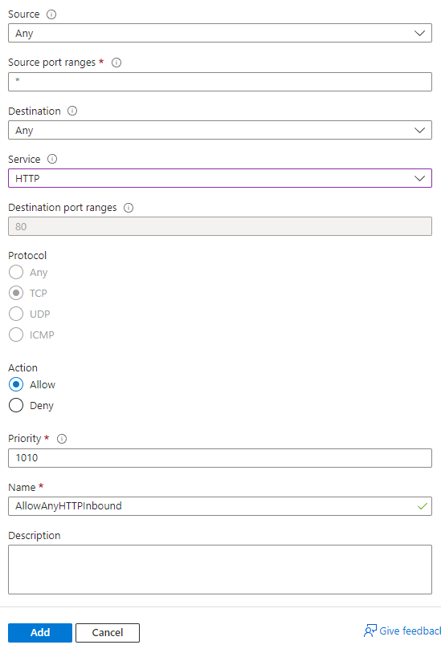

# 2 Tier App deployment

This guide outlines the steps to deploy a 2-tier application on Microsoft Azure. The deployment process involves setting up SSH keys, configuring virtual networks, provisioning virtual machines, deploying a database, and running application scripts. Below are the detailed steps for each component of the deployment process:

- [2 Tier App deployment](#2-tier-app-deployment)
  - [SSH Key](#ssh-key)
    - [Step 1](#step-1)
    - [Step 2](#step-2)
    - [Step 3](#step-3)
    - [Step 4](#step-4)
    - [Step 5](#step-5)
    - [Step 6](#step-6)
    - [Step 7](#step-7)
    - [Step 8](#step-8)
    - [Step 9](#step-9)
    - [Step 10](#step-10)
    - [Step 11](#step-11)
    - [Step 12](#step-12)
  - [- Virtual Network](#--virtual-network)
    - [Step 13](#step-13)
    - [Step 14](#step-14)
    - [Step 15](#step-15)
    - [Step 16](#step-16)
    - [Step 17](#step-17)
    - [Step 18](#step-18)
    - [Step 19](#step-19)
    - [Step 20](#step-20)
    - [Step 21](#step-21)
    - [Step 22](#step-22)
  - [- Virtual Machine (App)](#--virtual-machine-app)
    - [Step 23](#step-23)
    - [Step 24](#step-24)
    - [Step 25](#step-25)
    - [Step 26](#step-26)
    - [Step 27](#step-27)
    - [Step 28](#step-28)
    - [Step 29](#step-29)
    - [Step 30](#step-30)
    - [Step 31](#step-31)
    - [Step 32](#step-32)
    - [Step 33](#step-33)
    - [Step 34](#step-34)
    - [Step 35](#step-35)
    - [Step 36](#step-36)
    - [Step 37](#step-37)
    - [Step 38](#step-38)
    - [Step 39](#step-39)
    - [Step 40](#step-40)
    - [Step 41](#step-41)
    - [Step 42](#step-42)
    - [Step 43](#step-43)
  - [Database Deployment](#database-deployment)
    - [Step 44](#step-44)
  - [Database Script](#database-script)
    - [Step 45](#step-45)
  - [App Script](#app-script)
    - [Step 46](#step-46)
  - [Testing](#testing)
    - [Step 47](#step-47)
    - [Step 48](#step-48)
- [Differences between AWS and Azure: SSH Keys, Virtual Networks, and Virtual Machines](#differences-between-aws-and-azure-ssh-keys-virtual-networks-and-virtual-machines)
  - [SSH Keys](#ssh-keys)
    - [AWS](#aws)
    - [Azure](#azure)
  - [Virtual Networks](#virtual-networks)
    - [AWS](#aws-1)
    - [Azure](#azure-1)
  - [Virtual Machines](#virtual-machines)
    - [AWS](#aws-2)
    - [Azure](#azure-2)


## SSH Key
### Step 1
Search For SSH keys in azure and click on "SSH keys"


### Step 2
Click "Create"


### Step 3
Choose a subscription


### Step 4
Select the resource group "tech258"


### Step 5
Make sure the correct Region is selected


### Step 6
Enter the Key pair name


### Step 7
For "SSH public key source" either choose Generate new key pair or Upload existing public key, For this I will chooe Upload existing public key


### Step 8
Enter existing public key


### Step 9
Create tags


### Step 10
Review Changes


### Step 11
Click create


### Step 12
Refresh and make sure the key is in the list


## - Virtual Network 
### Step 13 
In the seach bar of Azure, Input Virutal Network and click it, as in step 1.


### Step 14
Click Create


### Step 15
Input the Subscription, Resource group, Virtual Network name and Region


### Step 16
Click IP Addresses


### Step 17
Click Add Subnet


### Step 18
Change the name to public-subnet and change the starting address to 10.0.1.0 and change the Size to /24 


### Step 19
Create a new subnet and Change the name to private-subnet and change the starting address to 10.0.3.0 and change the Size to /24 


### Step 20
Then hit next and contiue to the tags section and write owner with your tag name


### Step 21
Review the Virtual Network and press create


### Step 22
Refresh and Check the list of networks


## - Virtual Machine (App)
### Step 23 
Click on the serach bar and input "virtual machines" and click Virtual machines


### Step 24
Click Create


### Step 25
Click Azure virtual machine


### Step 26
In project details, Select the Subscription and Resource group


### Step 27
In the instance details section, Change the Virutal machine name, Region, Image and Size


### Step 28
In the Administrator account section, Cahnge the Authentication type to SSH public key, Change the Username to adminuser, change the SSH public key source to Use existing key stored in Azure and Select the previous key with Stored Keys


### Step 29
Click on Disks


### Step 30
In OS disk, change OS disk type to Standard SSD (locally-redundant storage)


### Step 31
Click on Networking


### Step 32
In Network interface, Choose the Virtual network from previous steps and select the public-subnet Subnet.


### Step 33
Click Advanced for NIC network security group


### Step 34
For Configure network security group, Click Create new


### Step 35
Choose a Name and click "Add an inbound rule"


### Step 36
Click Serivce and then HTTP, Then click Add



### Step 37
Add another inbound rule, however change Destination port ranges to 3000 and protocol to TCP then click Add 


### Step 38
Review changes and click ok


### Step 39
Navigate to Tags


### Step 40
Click Owner and add Name


### Step 41
Click Review + create


### Step 42
Review changes and click Create


### Step 43
Click refresh and check the list


## Database Deployment
### Step 44
Complete the steps for the App deployment however for the networking change the subnet to private-subnet.

## Database Script
### Step 45
Connect to the instance and run the Database script

```
#!/bin/bash

echo updating...
sudo apt update -y
echo done!

echo upgrading packages...
sudo DEBIAN_FRONTEND=noninteractive apt upgrade -y
echo done!

echo importing the public key used by the package management system
sudo apt-get install gnupg curl
echo done!

echo importing the MongoDB public GPG key
curl -fsSL https://www.mongodb.org/static/pgp/server-7.0.asc | \
   sudo -E gpg -o /usr/share/keyrings/mongodb-server-7.0.gpg \
   --dearmor --yes
echo done!

echo creating a list file for MongoDB
echo "deb [ arch=amd64,arm64 signed-by=/usr/share/keyrings/mongodb-server-7.0.gpg ] https://repo.mongodb.org/apt/ubuntu jammy/mongodb-org/7.0 multiverse" | sudo tee /etc/apt/sources.list.d/mongodb-org-7.0.list
echo done!

echo reloading local package database
sudo apt-get update
echo done!

echo installing mongo db 7.0.6
sudo DEBIAN_FRONTEND=noninteractive apt-get install -y mongodb-org=7.0.6 mongodb-org-database=7.0.6 mongodb-org-server=7.0.6 mongodb-mongosh=2.2.4 mongodb-org-mongos=7.0.6 mongodb-org-tools=7.0.6
echo done!

echo set versions
echo "mongodb-org hold" | sudo dpkg --set-selections
echo "mongodb-org-database hold" | sudo dpkg --set-selections
echo "mongodb-org-server hold" | sudo dpkg --set-selections
echo "mongodb-mongosh hold" | sudo dpkg --set-selections
echo "mongodb-org-mongos hold" | sudo dpkg --set-selections
echo "mongodb-org-tools hold" | sudo dpkg --set-selections
echo done!

echo configuring bind IP in mongo db config file - 0.0.0.0
sudo sed -i "s,\\(^[[:blank:]]*bindIp:\\) .*,\\1 0.0.0.0," /etc/mongod.conf
echo done!

echo restarting mongo db #f(or start)
sudo systemctl restart mongod
echo done!

echo enabling mongo db
sudo systemctl enable mongod
echo done!
```
## App Script
### Step 46
Connect to the instance and run the App Deployment script

```
#!/bin/bash

echo updating...
sudo apt update -y
echo done!

echo upgrading packages...
sudo DEBIAN_FRONTEND=noninteractive apt upgrade -y
echo done!

echo installing nginx...
sudo DEBIAN_FRONTEND=noninteractive apt install nginx -y 
echo done!

# configure reverse proxy
sudo sed -i '51s/.*/\t        proxy_pass http:\/\/localhost:3000;/' /etc/nginx/sites-available/default
# changing a config file

echo restarting nginx...
sudo systemctl restart nginx
echo done!

echo enabling nginx...
sudo systemctl enable nginx
echo done!

echo install node js
curl -fsSL https://deb.nodesource.com/setup_20.x | sudo DEBIAN_FRONTEND=noninteractive -E bash - && sudo DEBIAN_FRONTEND=noninteractive apt-get install -y nodejs
echo done!

echocheck js version
note -v
echo done!

echo set DB_HOST env var
export DB_HOST=mongodb://10.0.0.4:27017/posts
echo done!

echo install app folder
git clone https://github.com/Luix-Sparta/tech258-sparta-test-app.git
echo done!

echo cd app folder
cd ~/tech258-sparta-test-app/app
echo done!

echo install npm
sudo -E npm install
echo done!

echo install pm2
sudo -E npm install -g pm2
echo done!

echo stop app
pm2 stop app
echo done!

echo start app
pm2 start app.js app
echo done!

```

## Testing
### Step 47
Go to the App Deployment Virtual Machine find the Public Ip


### Step 48
Enter IP Address/Posts into Web Browser


# Differences between AWS and Azure: SSH Keys, Virtual Networks, and Virtual Machines

## SSH Keys

### AWS
- In AWS, when you create an EC2 instance, you can choose to use SSH key pairs for authentication.
- AWS uses the concept of key pairs, where you generate a key pair locally and then upload the public key to AWS. The private key remains on your local machine.
- You can associate a specific SSH key pair with an EC2 instance during the instance creation process or later by modifying the instance settings.

### Azure
- Similarly, in Azure, SSH key pairs can be used for authentication when accessing virtual machines.
- Azure also uses the concept of key pairs, but it handles the generation and management of SSH keys within the Azure portal.
- When creating a virtual machine in Azure, you can either use password authentication or SSH key authentication. If SSH key authentication is chosen, Azure generates the key pair and associates it with the virtual machine.

## Virtual Networks

### AWS
- In AWS, virtual networks are known as Virtual Private Clouds (VPCs).
- VPCs allow you to logically isolate your resources in the cloud, providing network-level control and security.
- You can create multiple VPCs in different AWS regions and connect them using VPC peering or VPN connections.

### Azure
- Azure's equivalent of VPCs is called Virtual Networks (VNets).
- VNets also offer network isolation and segmentation for Azure resources.
- Azure VNets support features like subnetting, Network Security Groups (NSGs), and Virtual Network Gateways for connecting on-premises networks to Azure VNets.

## Virtual Machines

### AWS
- AWS provides Elastic Compute Cloud (EC2) for virtual machine provisioning.
- EC2 instances come in various types and sizes, allowing you to choose resources based on your workload requirements.
- AWS offers a wide range of operating system choices for EC2 instances, including various Linux distributions and Windows Server.

### Azure
- Azure offers Virtual Machines (VMs) for running applications and workloads in the cloud.
- Similar to AWS, Azure VMs come in different sizes and configurations to meet varying performance and scalability needs.
- Azure VMs support both Windows and Linux operating systems, with a variety of pre-configured images available in the Azure Marketplace.